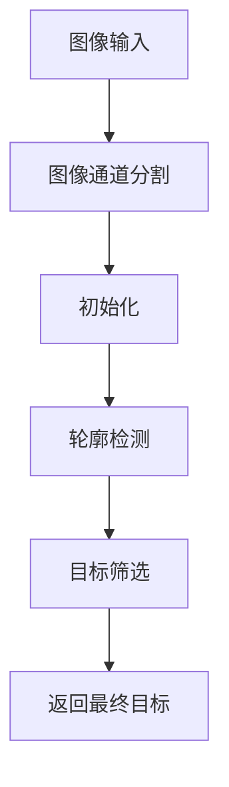
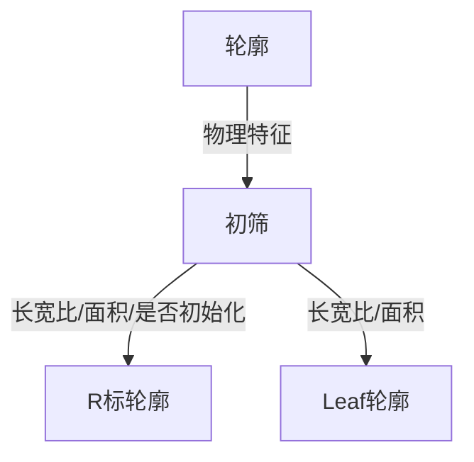
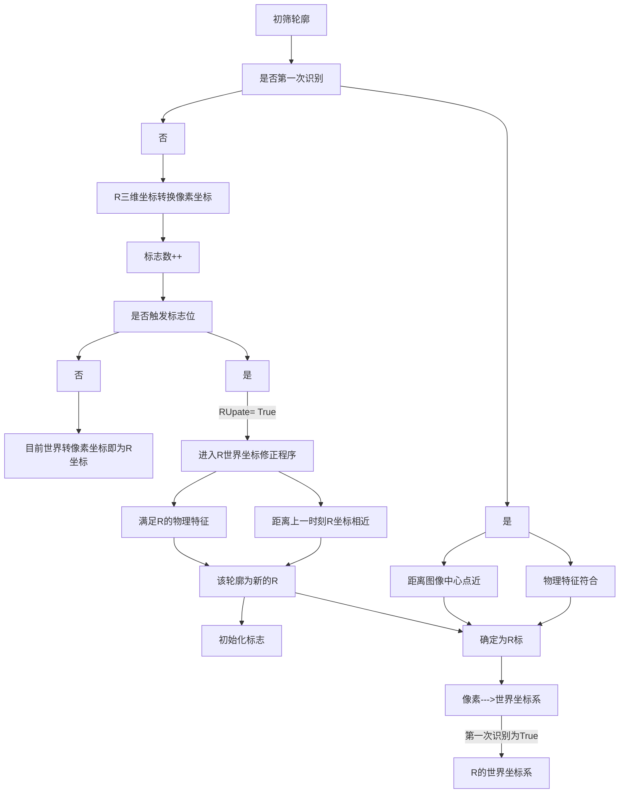
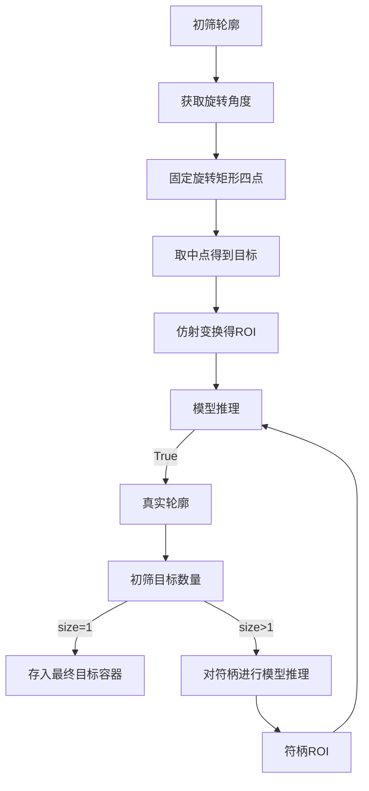
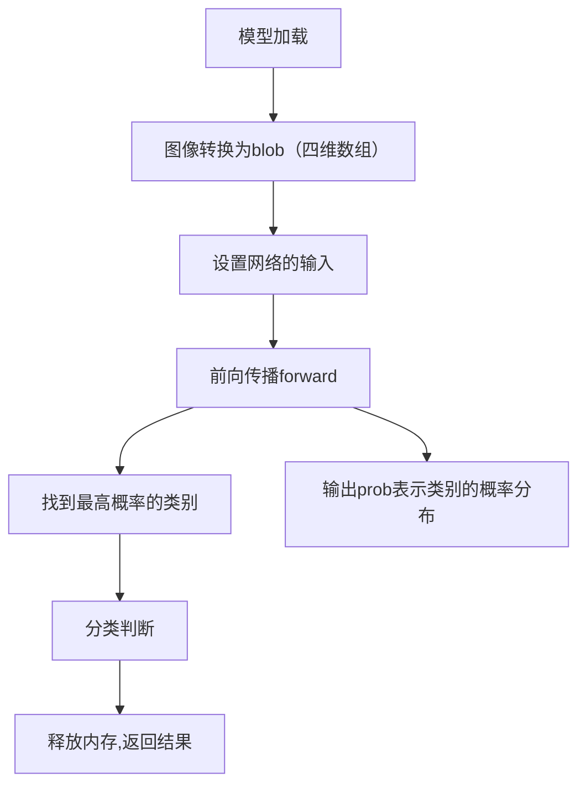

<div align="center"> <h2>2024深圳技术大学|悍匠战队能量机关识别思路开源 </h2></div>
 


 
<br>

 

<center><h3> 算法的大致思路</h3></center>

很多队伍开源的识别能量机关的算法，基本是基于`流水灯`来识别目标的轮廓的。在`环境光不理想`的情况下，可能识别不到`流水灯`。
因此提出一种基于`简单神经网络与传统视觉`结合的算法。

1. 传统视觉算法找到扇叶的整体轮廓
2. 固定扇叶的四点坐标，防止旋转过程跳变。再取两侧中点，因此可以得到扇叶末端矩形图案 

 

<center>
<div style="display: flex; justify-content: center;">
    
    
</div>
</center>
 

3. 因为图案有很多个，因此想到使用神经网络采用`LeNet-5` 作为图案的分类器 输入为`单通道` `30x30`的 `ROI`

4. 针对识别到多个目标情况，可以加一个分类器去其他区域的图案，可以做到`准确率100%`。


#### 优缺点

**优点**

1. `处理速度方面`:因为是单通道 加上 图像大小为30x30，所以识别速度非常快。平均每帧识别+预测能达到`4-5ms`。
2. `模型性能和数据集`: 因为图像大小才30x30, 包含的特征少，如果特征非常相似会识别为同一类（10环 和 目标图案）。 因此可以根据其他区域的特征多重分类，对整体速度影响不大。 数据集方面通过保存扇叶末端ROI的图片，得到各个分类图案。
3. `环境光要求不大`: 只要能识别到扇叶都没问题。
4. ...

**缺点**
1. 模型需要微调，提高泛化能力
2. 需要对得到多个目标进行筛选得到最终目标
3. ...

<video width="100%" height="80%" controls>
  <source src="https://github.com/user-attachments/assets/6f0700aa-6c86-446e-a70a-2b5157fbbb08" type="video/mp4">
</video>


<center><h3>  详细的识别逻辑 <h3></center>


### 1. 概念介绍

😹能量机关这玩意儿，很抽象。官方名字称能量机关，但有叫`buff` 又叫 `符` 。所以为了理解下面算法思路，引入 符叶和符柄的概念
<br>
概念：(如叶子:叶一般由叶片、 叶柄 和 托叶 三部分组成)
- `符叶` leaf 
- `符柄` handle
- `目标` target
<details>
<summary>符叶的样子</summary>


</details>
<details>
<summary>符柄的样子</summary>


</details>
<details>
<summary>目标 target</summary>

</details>

### 2. 识别流程函数


 

### 3. 轮廓的识别



### 4. 对R的识别流程


**注意**
- 第一次识别需要操作手`手动`将`图像中心或者UI中心对准R标`才会进入识别
- 只要第一次识别后且更新标志不为True 则只单纯使用`世界坐标转换得到图像坐标`作为R标的图像位置


### 5.1 对Leaf识别


 

#### 5.2 固定坐标 

Qustion: 🤔为什么需要固定坐标?

Answer: **因为符是旋转的，而是使用旋转矩形后，随着角度变化，符叶四个点会发生变化。方便后期仿射变换得到要求的ROI图像**


**坐标顺序（当前代码以图1为正参照）**

- leaf_target[0]        左下
- leaf_target[1]        左上
- leaf_target[2]        右上
- leaf_target[3]        右下

<div style="text-align: center;">
    
    
</div>


<details>
<summary>对应代码</summary>

```c++
if (leaf_.angle >= 0 && leaf_.angle < 91 || leaf_.angle >= 353 && leaf_.angle <= 360) {
            leaf_target[0] = Vertex[0];
            leaf_target[1] = Vertex[1];
            leaf_target[2] = Vertex[2];
            leaf_target[3] = Vertex[3];

        } else if (leaf_.angle >= 91 && leaf_.angle < 181) {
            leaf_target[0] = Vertex[3];
            leaf_target[1] = Vertex[0];
            leaf_target[2] = Vertex[1];
            leaf_target[3] = Vertex[2];

        } else if (leaf_.angle >= 181 && leaf_.angle < 266) {
            leaf_target[0] = Vertex[2];
            leaf_target[1] = Vertex[3];
            leaf_target[2] = Vertex[0];
            leaf_target[3] = Vertex[1];

        } else {
            leaf_target[0] = Vertex[1];
            leaf_target[1] = Vertex[2];
            leaf_target[2] = Vertex[3];
            leaf_target[3] = Vertex[0];
        }
```


</details>

 

#### 5.3 目标

**5.3.1目标的点顺序（固定|预测框的点位也要一样）**

<div style="text-align: center;">
    
    
</div>

**5.3.2目标干扰**

<span style="color: red;">1.打中十环后的图案和目标图案是非常相似的,使用要使用符柄进行二筛。</span>


<span style="color: red;">2.出现两个目标进行二筛。</span>


#### 5.4.1 模型训练

使用了经典的卷积神经网络LeNet-5 模型 ，修改了卷积核大小 ，加了Dropout层，提高了模型的泛化能力。

`代码仅供参考`

```py
class SimpleLeNet5(nn.Module):
    def __init__(self, num_classes):
        super(SimpleLeNet5, self).__init__()
        self.conv1 = nn.Conv2d(1, 6, kernel_size=2)

        self.pool1 = nn.MaxPool2d(kernel_size=2, stride=2)
        self.conv2 = nn.Conv2d(6, 12, kernel_size=2)

        self.pool2 = nn.MaxPool2d(kernel_size=2, stride=2)
        self.fc1 = nn.Linear(12 * 6 * 6, 256)  
        self.dropout= nn.Dropout(0.5)
        self.fc2 = nn.Linear(256, 128)
        self.fc3 = nn.Linear(128, 64)
        self.fc4 = nn.Linear(64, num_classes)


    def forward(self, x):
        # print(x.shape)
        x = self.pool1(torch.relu(self.conv1(x)))
        x = self.pool2(torch.relu(self.conv2(x)))
        # print(x.shape)
        x = x.view(x.size(0), -1)
        x = torch.relu(self.fc1(x))
        x = self.dropout(x)
        x = torch.relu(self.fc2(x))
        x = self.dropout(x)
        x = torch.relu(self.fc3(x))
        x = self.dropout(x)
        x = self.fc4(x)
        return x

```

#### 5.4.2 模型训练数据集

1. `首次训练` : 保存扇叶末端图案的ROI就行，手动分类数据集去训练。
2. `得到分类器权重之后训练` : 代码加上分类器后，可以自动保存多个类的数据集

>模型数据集收集很快的，一个视频都有不同类几千张数据集。 我只划分了4个类 。


#### 5.5 模型推理
>该分类器的实现基于 OpenCV 的 DNN（深度神经网络）模块来加载和推理 ONNX 模型，并返回一个布尔值




<details>
<summary>模型推理代码</summary>

```c++
bool BuffDetection::classifier(cv::Mat &src, size_t id, std::string &ModePath) {
    double confidence;
    size_t classId;
    // 加载ONNX模型

    cv::dnn::Net net = cv::dnn::readNetFromONNX(ModePath);

    // 将图像转换为blob
    cv::Mat blob = cv::dnn::blobFromImage(src, 1.0, cv::Size(30, 30), cv::Scalar(), true, false);

    // 设置网络的输入
    net.setInput(blob);

    // 进行前向传播以获取输出
    cv::Mat prob = net.forward();

    // 找到概率最高的类别
    cv::Point classIdPoint;
    minMaxLoc(prob.reshape(1, 1), nullptr, &confidence, nullptr, &classIdPoint);

    classId = classIdPoint.x;

    if (classId == id && confidence * 100 > leaf_classifier_confidence) {
        blob.release();
        prob.release();
        return true;
    } else {

        blob.release();
        prob.release();
        return false;
    }
}
```
</details>


---

## 能量机关预测


### 1.小能量机关预测

固定预测角度就行。没啥难度...


### 2.大能量机关预测


**大能量机关预测参考了以下队伍能量机关预测算法（感谢开源！） ，也可以参考近期其他队伍开源的能量机关识别预测算法。**


- [西安电子科技大学-IRobot战队能量机关拟合部分](https://github.com/SanZoom/RM2022-Infantry-Vision/blob/master/src/Rune/Fitting.cpp) 
- [桂林电子科技大学Evolution战队能量机关预测部分](https://github.com/freezing00/Baldr/blob/main/Src/angle/CoordinateSolver/BuffCoordinateSolver.cpp)

预测思路可以看佛科大的大能量机关推导

- [佛山大学醒狮战队大能量机关推导](https://github.com/Ash1104/RoboMaster2021-FOSU-AWAKENLION-OpenSource/blob/master/%E5%A4%A7%E8%83%BD%E9%87%8F%E6%9C%BA%E5%85%B3%E6%8E%A8%E5%AF%BC.pdf)


 
